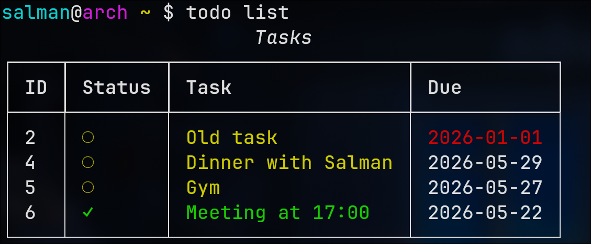

# todo-cli

First Python project after finishing CS50. A CLI todo app.

Uses `typer` for commands, `rich` for the table output, and `SQLite` to store tasks.



## Install

```bash
git clone https://github.com/Salman7236/todo-cli.git
cd todo-cli
pipx install .
```

## Commands

```bash
todo add "Buy milk"
todo add "Submit report" --due 2026-05-25   # defaults to today if omitted
todo list
todo list --filter done
todo list --filter pending
todo list --filter overdue
todo complete 1
todo delete 1
```
